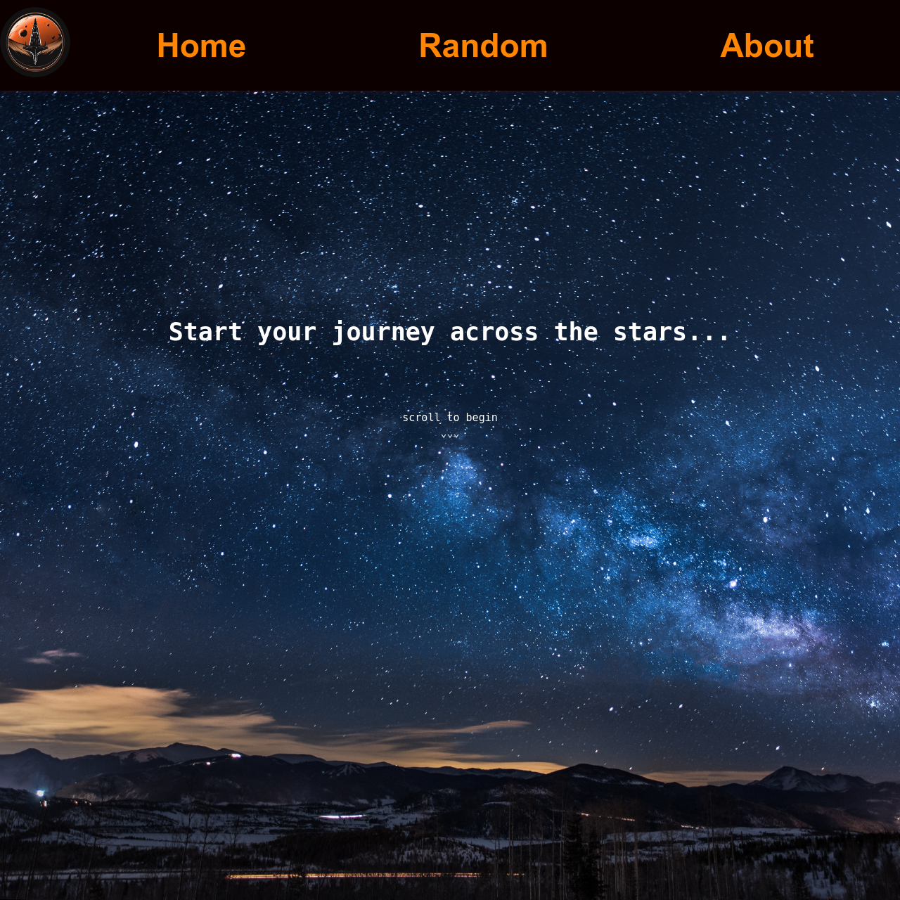

# Astraeus Travel

## Description

Have you ever wanted to travel to the stars and explore the planets in our solar system? This application allows you to start your journey to our planets and find out things like, how many moons does it have? How far is it from the sun? How long a year is?

[Happy adventures!](https://astraeustravel.com/)

## Table of Contents

- [Description](#description)

- [Table of Contents](#table-of-contents)

- [Installation](#installation)

- [Usage](#usage)

- [Contributing](#contributing)

- [Credits](#credits)

- [License](#license)

## Installation

No installation needed - simply visit the website at [https://astraeustravel.com/](https://astraeustravel.com/) and start your journey to the stars.

## Usage

Load the webpage at [https://astraeustravel.com/](https://astraeustravel.com/) and scroll down to the solar system. Press the planet you would like to travel to.

## Contributing

Astraeus Travel is brought to you by: 

* Adam (https://github.com/bowseruk/)
* Anil (https://github.com/Skyline199/)
* Christos (https://github.com/ChrisCode3/)
* Claire (https://github.com/Ing3rs/)
* Clarissa (https://github.com/RissaC2/)
* Daisy (https://github.com/DaisyEverard/)

## Credits

The following resources were important for this project.

- [Readme Generator](https://github.com/bowseruk/readme-generator-nodejs) for generating the readme.

## License

This project is licensed under the [MIT](https://opensource.org/licenses/MIT) license.

This full license used by the project is in the LICENSE file of the repo.
